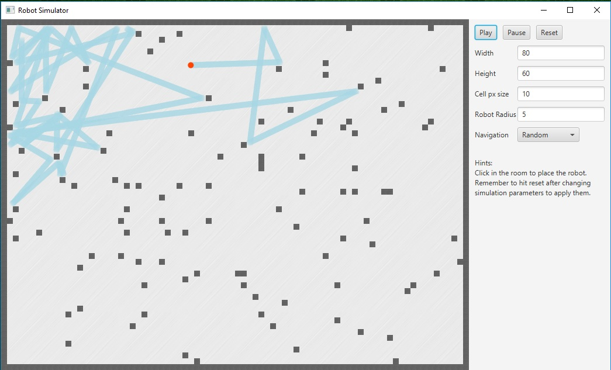
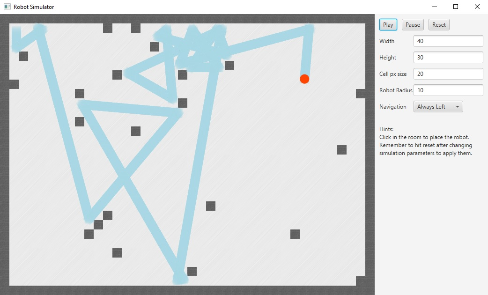

# RobotSimulator
## A JavaFX based obstacle avoidance robot simulator





### What motivated this project?
I'm afraid there's no highly motivating story behind the project, to reduce it to
a single word it could be anxiety. I bought a Smart Car Kit from a chinese store
and the package takes around 2 months to reach my door so, I needed something to 
start experiencing with the idea of programming a robot without waiting that much
time and then something else came to my mind.

What if I create a piece of software where I can test my navigation algorithms and
its behavior in a strictly controlled environment before hitting the real world?

After surfing the web a little bit I found all kinds of alternatives but I thought
the best way to spend some free time would be building something from scratch,
learn something new and for the first time (because if you see my other repos to
date are all excercises or an experimental extension) sharing it to the community,
who knows if there is any soul out there that would give a try to this piece of
software.

### Why Java and JavaFX?
I'm comfortable coding in 2 languages, Java and Javascript. Everytime I think about
writing something in javascript I spend a ton of time looking for projects and
dependencies for about everything because, you know, js is relly hot and everyone
is writing everything with it, which is great but I wanted to jump directly into
code.

Since the last time I developed a working graphical desktop application with Java 
was back at the university I thought this was a great chance to do another one. 
After googling a little bit I decided to use JavaFX for the UI (as a logical next
step to my experience with Swing) and it was really fun to read a couple of days
later that Oracle was leaving future efforts for JavaFX completely to the community
and separating it from the JDK 

### Requirements
Project currently needs **Maven** and **Java 8** to be built and packed.
At the moment there are no dependencies but I guess starting from Java 11 we'll
need to add JavaFX as a dependency :)

### Package and run
```
mvn package
java -jar ./target/robotsimulator-1.0-SNAPSHOT.jar
```